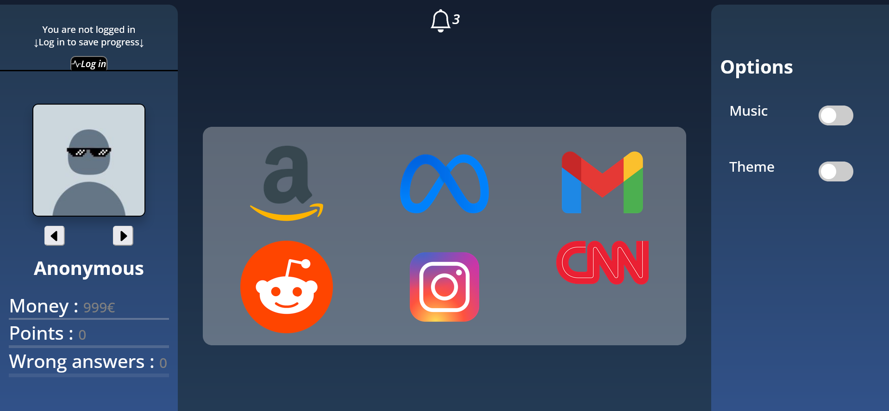

# Spot the Dark Pattern Mäng

Projekt on tehtud Tallinna Ülikooli [Digitehnoloogiate instituudi](https://www.tlu.ee/dt) suvepraktika raames
## Autorid: 
 - Mares Sumarok
 - Filipp-Artur Pljassunov


# Projekti eesmärk ja lühihkirjeldus
Projekti eesmärk on seletada kasutajale mis on "Dark pattern" ja kuidas seda eristada veebilehtedel.
Tellijaga kooskõlas otsustasime näidata kasutajale pilti tume mustri näidega, nii mängija saab aru kuidas tumemustrid näevad välja päris elus.
"Äppide" sees kasutaja leiab tume mustri või vastatab esitatud küsimusele tume mustrite kohta.
Mängu käigus kasutaja näeb kas ta vastas õigesti või valesti, ning kogutud punkti summa ja vale vastuste numbri.
Mängu lõpus kasutaja saab ennast teiste mängijatega võrrelda.

# Ekraanipilt
Peamenüü



# Kasutatud tehnoloogiad
 - HTML5
 - CSS
 - JS
 - React(18.0.0)
 - Firebase (9.8.1)


# Paigaldusjuhised
1. Laadi all või kloneeri github repositoriumi
2. Installige [Node.js](https://nodejs.org/en/download/)
3. Vajalikke moodulite laadimiseks:  `npm install`
4. Lisa [dark-patterns-project-db-backup.json](dark-patterns-project-db-backup.json) oma "firebase realtime database" sisse.
    Osa objektidest automaatselt ilmub äppi töö ajal. Näiteks need mis on seotud kasutaja registreerimisega ja andmete salvestamisega.
5. Loo faili src/firebase.js sellisel kujul:
    ```javascript
   import {initializeApp} from "firebase/app";
   import {getDatabase,ref} from "firebase/database";

    const firebaseConfig = {
        apiKey: "sini api võti",
        authDomain: "sinu firebase domeen",
        databaseURL: "sinu andmebaasi url",
        projectId: "sinu projekti nimi",
    };
   
    export const app = initializeApp(firebaseConfig);
    export const dbRef = ref(getDatabase());
    export const db = getDatabase();
   ```
6. Rakenduse käivitamiseks: `npm start`
7. Kui midagi on puudu reakt annab sellest teada.


# Litsents
[Litsents (MIT)](LICENSE)
